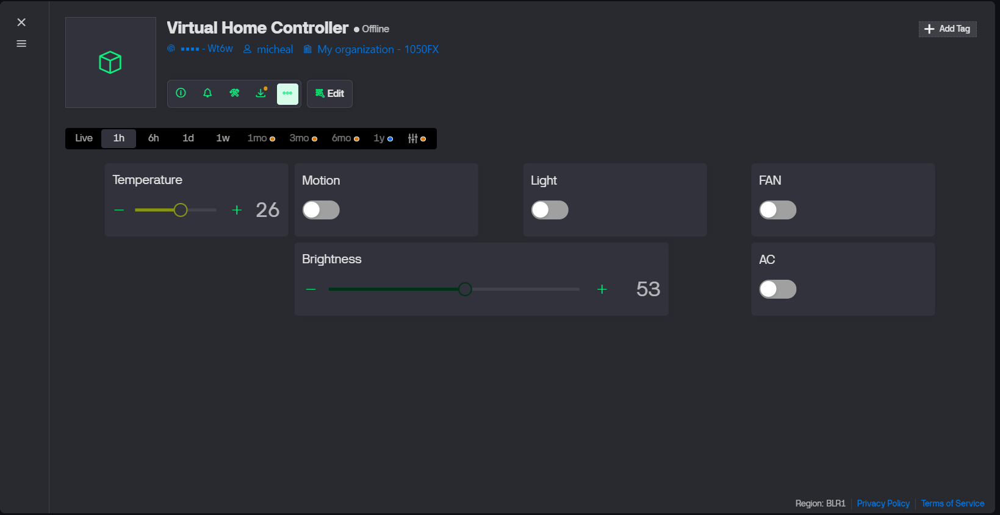

# Smart-Home-Automation
Smart Home Automation Using IoT (Python + Blynk + Streamlit)
This project is a fully virtual smart‑home automation system built with Python, Blynk Cloud, and Streamlit. It simulates sensors, sends their data to the cloud through the Blynk HTTPS API, and applies automation rules to control virtual appliances such as a Light, Fan, and AC.

## 🔧 Features
- Simulated IoT sensors:

  - Temperature (°C)

  - Light level (%)

  - Motion detection (Yes/No)

- Virtual actuators:
  
  - Light (ON/OFF)

  - Fan (ON/OFF)

  - Air Conditioner (ON/OFF)

- Cloud integration using Blynk virtual pins (V1–V6).

- Streamlit dashboard for real‑time monitoring on the local machine.

- Blynk web/mobile dashboards for remote monitoring and control.

- Works completely without physical hardware (purely virtual setup).

## 🧱 Project Structure
```
├── Blynk_api.py        # Helper wrapper for Blynk HTTPS datastream API
├── virtual_sensors.py  # Virtual sensor simulation (Temp, Light, Motion)
├── automation.py       # Smart home automation logic and actuator control
├── Dashboard.py        # Streamlit dashboard for local visualization
├── requirements.txt    # Python dependencies
└── README.md           # Project documentation
```
- Blynk_api.py

  - Provides helper functions to update and read Blynk virtual pins using HTTPS.

- virtual_sensors.py

  - Periodically generates random but realistic sensor data and uploads it to Blynk.

- automation.py

  - Reads sensor values from Blynk, applies threshold‑based rules, and updates actuator states.

- Dashboard.py

  - Uses Streamlit to display live sensor readings and appliance status in a web UI.

## 🌐 Blynk Cloud Setup
- Create a Template in Blynk Console (e.g., Virtual Home Controller).

- Create a Device from this template and copy its Auth Token.

- Add the following Datastreams (Virtual Pins):

  - V1 – Temperature (Double/Float, unit: °C, range: 0–50)

  - V2 – Light Level (Integer, unit: %, range: 0–100)

  - V3 – Motion (Integer, 0 = No, 1 = Yes)

  - V4 – Light Actuator (Integer, 0 = OFF, 1 = ON)

  - V5 – Fan Actuator (Integer, 0 = OFF, 1 = ON)

  - V6 – AC Actuator (Integer, 0 = OFF, 1 = ON)

- Design a Web Dashboard in Blynk:

  - Gauge / Value widgets bound to V1, V2, V3.

  - Switch widgets bound to V4, V5, V6.

## ⚙️ Configuration
- Replace the placeholder token in all scripts with your Blynk device Auth Token:

  - BLYNK_AUTH / BLYNK_TOKEN in:

    - virtual_sensors.py

    - automation.py

    - Dashboard.py

- Set the correct Blynk HTTPS base URL based on your region (example):

```
BASE_URL = "https://blr1.blynk.cloud/external/api"
```
- Map virtual pins consistently:

  - V1 → Temperature

  - V2 → Light Level

  - V3 → Motion

  - V4 → Light

  - V5 → Fan

  - V6 → AC

## 📦 Installation
- Make sure Python 3.x is installed.

- Install required packages:

```
pip install -r requirements.txt
```
Typical dependencies include:

- ```requests``` – for HTTP requests to Blynk Cloud

- ```streamlit``` – for the local dashboard

## ▶️ How to Run
Run the scripts in this order:

### 1. Start virtual sensors

```
python virtual_sensors.py
```

   - Simulates temperature, light level, and motion.

   - Continuously updates Blynk virtual pins V1, V2, and V3.


### 2. Start automation logic

```python automation.py```

  - Reads sensor values from V1, V2, V3.

  - Applies rules and updates V4 (Light), V5 (Fan), V6 (AC).

### 3. Launch Streamlit dashboard
```
streamlit run Dashboard.py
```
- Opens a local web interface (usually at http://localhost:8501).

- Shows live sensor readings and appliance statuses.


### 4. Use Blynk dashboards

- Open Blynk Console (web) or the Blynk mobile app.

- View the same sensor and actuator data, and interact with the switches for Light, Fan, and AC.


## 🤖 Automation Rules (Example)
- AC Control

  - Turn AC ON when temperature ≥ 30 °C.

  - Turn AC OFF when temperature < 30 °C.

- Fan Control

  - Turn Fan ON when temperature ≥ 28 °C.

  - Turn Fan OFF otherwise.

- Light Control

  - Turn Light ON when:

    - Light level < 30% and Motion = 1.

  - Turn Light OFF otherwise.

- You can tweak these thresholds and rules in automation.py to experiment with different behaviours.

## 🧪 Demo & Use‑Cases
- Demonstrates IoT concepts for academic projects.

- Explains how cloud‑based dashboards interact with edge logic.

- Can be extended to real hardware later by replacing virtual sensors with microcontroller code that uses the same Blynk virtual pins.
